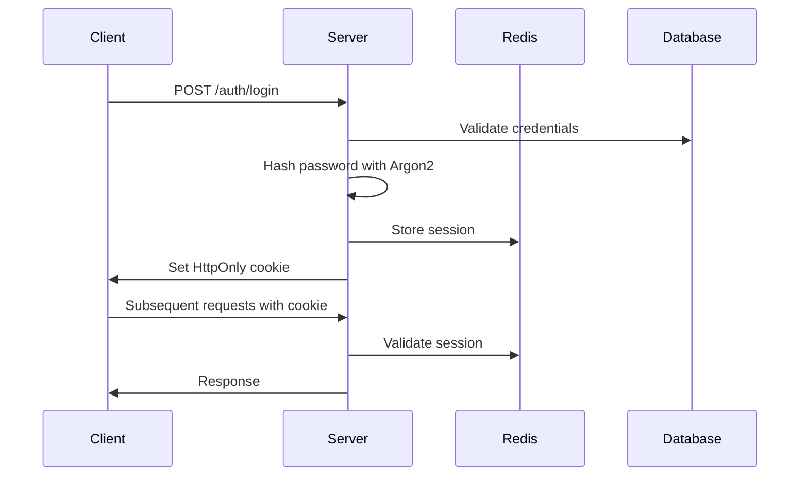

# ארכיטקטורת מערכת - מערכת ניהול משימות משותפת

## סקירה כללית

מערכת ניהול משימות משותפת המבוססת על ארכיטקטורת Microservices עם Frontend ו-Backend נפרדים, תמיכה בזמן אמת באמצעות WebSockets, ומסד נתונים NoSQL.

## ארכיטקטורת מערכת

```
┌─────────────────┐    ┌─────────────────┐    ┌─────────────────┐
│   Frontend      │    │    Backend      │    │   Database      │
│   (Next.js)     │◄──►│   (Node.js)     │◄──►│   (MongoDB)     │
│                 │    │                 │    │                 │
│ - React         │    │ - Fastify       │    │ - Atlas         │
│ - TypeScript    │    │ - Socket.io     │    │ - Prisma        │
│ - Tailwind      │    │ - Prisma        │    │                 │
│ - Zustand       │    │ - Argon2        │    └─────────────────┘
│ - Socket.io     │    │ - Pino          │
└─────────────────┘    └─────────────────┘
         │                       │
         │                       │
         ▼                       ▼
┌─────────────────┐    ┌─────────────────┐
│   Deployment    │    │     Cache       │
│                 │    │                 │
│ - Vercel        │    │ - Redis         │
│ - Render/Fly    │    │ - Sessions      │
│ - GitHub Actions│    │ - WS Adapter    │
└─────────────────┘    └─────────────────┘
```

## מחסנית טכנולוגית מפורטת

### Frontend Stack

```typescript
// Core Framework
Next.js 14+ (App Router)
TypeScript 5+ (strict mode)
React 18+ (Server Components)

// State Management
Zustand (lightweight state)
React Query (server state)

// UI & Styling
Tailwind CSS 3+
Headless UI (accessible components)
React Hook Form (form management)
Zod (validation)

// Real-time
Socket.io Client 4+
Reconnecting WebSocket

// Utilities
date-fns (date manipulation)
clsx (conditional classes)
```

### Backend Stack

```typescript
// Core Framework
Node.js 20+ (LTS)
Fastify 4+ (high-performance)
TypeScript 5+ (strict mode)

// Database & ORM
MongoDB Atlas 6+
Prisma 5+ (type-safe ORM)
MongoDB Driver

// Real-time
Socket.io 4+
Socket.io Redis Adapter

// Authentication & Security
Argon2id (password hashing)
JWT (optional, for stateless)
Cookie-based sessions
CSRF protection

// Validation & Serialization
Zod (schema validation)
Fastify validation
```

### Infrastructure

```yaml
# Database
MongoDB Atlas:
  - M0 (free tier) / M2 (production)
  - Automated backups
  - IP allowlist
  - Connection pooling

# Cache & Sessions
Redis Cloud:
  - 30MB (free) / 100MB+ (production)
  - Session storage
  - WebSocket adapter
  - Rate limiting

# Deployment
Frontend:
  - Vercel (automatic deployments)
  - Edge functions
  - CDN global

Backend:
  - Render/Fly.io/Railway
  - Auto-scaling
  - Health checks
  - WebSocket support
```

## מבנה נתונים (Database Schema)

### Collections Structure

```typescript
// Users Collection
interface User {
  _id: ObjectId;
  email: string; // unique, indexed
  name: string; // display name
  passwordHash?: string; // null for OAuth users
  provider: 'credentials' | 'google';
  createdAt: Date;
  updatedAt: Date;
}

// Tasks Collection
interface Task {
  _id: ObjectId;
  title: string; // required, 1-120 chars
  description?: string; // optional, max 5000 chars
  createdBy: ObjectId; // ref to User
  createdAt: Date;
  updatedBy?: ObjectId; // ref to User
  updatedAt: Date;
  assignees: ObjectId[]; // refs to Users
  version: number; // optimistic concurrency
  deletedAt?: Date; // soft delete
}

// Task Stars Collection (Personal)
interface TaskStar {
  _id: ObjectId;
  taskId: ObjectId; // ref to Task
  userId: ObjectId; // ref to User
  createdAt: Date;
  // Compound unique index: [taskId, userId]
}

// Task Audit Collection
interface TaskAudit {
  _id: ObjectId;
  taskId: ObjectId; // ref to Task
  at: Date;
  by: ObjectId; // ref to User
  action: 'create' | 'update' | 'delete' | 'duplicate';
  diff: object; // JSON-Patch or before/after
  metadata?: object; // additional context
}
```

### Indexes Strategy

```javascript
// Users
db.users.createIndex({ email: 1 }, { unique: true });
db.users.createIndex({ provider: 1 });

// Tasks
db.tasks.createIndex({ updatedAt: -1 }); // main sorting
db.tasks.createIndex({ createdAt: -1 }); // creation date
db.tasks.createIndex({ createdBy: 1 }); // user's tasks
db.tasks.createIndex({ assignees: 1 }); // assigned tasks
db.tasks.createIndex({ deletedAt: 1 }); // soft delete filter
db.tasks.createIndex({
  title: 'text',
  description: 'text',
}); // full-text search

// Task Stars
db.taskStars.createIndex({ userId: 1 }); // user's stars
db.taskStars.createIndex({ taskId: 1 }); // task's stars
db.taskStars.createIndex(
  {
    taskId: 1,
    userId: 1,
  },
  { unique: true }
); // prevent duplicates

// Task Audit
db.taskAudit.createIndex({ taskId: 1, at: -1 }); // task history
db.taskAudit.createIndex({ by: 1, at: -1 }); // user activity
```

## ארכיטקטורת API

### REST API Structure

```typescript
// Base URL: https://api.example.com/v1

// Authentication Routes
POST   /auth/signup
POST   /auth/login
POST   /auth/logout
GET    /auth/me
GET    /auth/google
GET    /auth/google/callback
POST   /auth/forgot
POST   /auth/reset

// Tasks Routes
GET    /tasks                    // List tasks (context-aware)
POST   /tasks                    // Create task
GET    /tasks/:id                // Get single task
PATCH  /tasks/:id                // Update task
DELETE /tasks/:id                // Soft delete task
POST   /tasks/:id/duplicate      // Duplicate task
PUT    /tasks/:id/assign/me      // Assign self to task

// Personal Routes
PUT    /tasks/:id/star           // Add star
DELETE /tasks/:id/star           // Remove star
GET    /me/starred               // Get starred tasks
GET    /me/tasks                 // Get my tasks
GET    /me/tasks/export          // Export my tasks

// Utility Routes
GET    /health                   // Health check
GET    /sync                     // Sync after reconnect
```

### WebSocket Events

```typescript
// Connection
socket.on('connect', () => {
  // Join rooms: 'board:all', 'user:<userId>'
});

// Task Events (board:all)
socket.on('task.created', (data: { task: Task }) => {});
socket.on('task.updated', (data: { taskId: string; patch: object }) => {});
socket.on('task.deleted', (data: { taskId: string }) => {});
socket.on(
  'task.duplicated',
  (data: { sourceTaskId: string; newTask: Task }) => {}
);
socket.on(
  'task.assigned',
  (data: { taskId: string; assigneeId: string }) => {}
);

// Personal Events (user:<id>)
socket.on('star.added', (data: { taskId: string }) => {});
socket.on('star.removed', (data: { taskId: string }) => {});

// System Events
socket.on('disconnect', (reason: string) => {});
socket.on('reconnect', (attemptNumber: number) => {});
```

## ארכיטקטורת אבטחה

### Authentication Flow



### Security Layers

```typescript
// 1. Input Validation
const taskSchema = z.object({
  title: z.string().min(1).max(120).trim(),
  description: z.string().max(5000).optional(),
  assignees: z.array(z.string().regex(/^[0-9a-fA-F]{24}$/)).max(20),
});

// 2. Authentication Middleware
const authenticate = async (request: FastifyRequest) => {
  const sessionId = request.cookies.session;
  if (!sessionId) throw new UnauthorizedError();

  const session = await redis.get(`session:${sessionId}`);
  if (!session) throw new UnauthorizedError();

  return JSON.parse(session);
};

// 3. Rate Limiting
const rateLimit = {
  windowMs: 15 * 60 * 1000, // 15 minutes
  max: 100, // limit each IP to 100 requests per windowMs
  message: 'Too many requests from this IP',
};

// 4. CSRF Protection
const csrfProtection = {
  cookie: {
    httpOnly: true,
    secure: process.env.NODE_ENV === 'production',
    sameSite: 'strict',
  },
};
```

## ארכיטקטורת פריסה

### Frontend Deployment (Vercel)

```yaml
# vercel.json
{
  'version': 2,
  'builds': [{ 'src': 'package.json', 'use': '@vercel/next' }],
  'env':
    {
      'NEXT_PUBLIC_API_BASE_URL': 'https://api.example.com',
      'NEXT_PUBLIC_WS_URL': 'wss://api.example.com',
      'NEXT_PUBLIC_TIMEZONE': 'Asia/Jerusalem',
    },
  'headers':
    [
      {
        'source': '/(.*)',
        'headers':
          [
            { 'key': 'X-Content-Type-Options', 'value': 'nosniff' },
            { 'key': 'X-Frame-Options', 'value': 'DENY' },
          ],
      },
    ],
}
```

### Backend Deployment (Render)

```yaml
# render.yaml
services:
  - type: web
    name: shared-tasks-api
    env: node
    buildCommand: npm ci && npm run build
    startCommand: npm start
    envVars:
      - key: NODE_ENV
        value: production
      - key: PORT
        value: 8080
      - key: DATABASE_URL
        sync: false
      - key: REDIS_URL
        sync: false
      - key: SESSION_SECRET
        sync: false
    healthCheckPath: /health
    autoDeploy: true
```

### CI/CD Pipeline

```yaml
# .github/workflows/ci.yml
name: CI/CD Pipeline

on:
  push:
    branches: [main, develop]
  pull_request:
    branches: [main]

jobs:
  test:
    runs-on: ubuntu-latest
    steps:
      - uses: actions/checkout@v4
      - uses: actions/setup-node@v4
        with:
          node-version: '20'
          cache: 'npm'

      - name: Install dependencies
        run: npm ci

      - name: Type check
        run: npm run typecheck

      - name: Lint
        run: npm run lint

      - name: Test
        run: npm test -- --coverage

      - name: Build
        run: npm run build

  deploy-frontend:
    needs: test
    if: github.ref == 'refs/heads/main'
    runs-on: ubuntu-latest
    steps:
      - uses: amondnet/vercel-action@v20
        with:
          vercel-token: ${{ secrets.VERCEL_TOKEN }}
          vercel-org-id: ${{ secrets.VERCEL_ORG_ID }}
          vercel-project-id: ${{ secrets.VERCEL_PROJECT_ID }}

  deploy-backend:
    needs: test
    if: github.ref == 'refs/heads/main'
    runs-on: ubuntu-latest
    steps:
      - name: Deploy to Render
        run: |
          curl -X POST "$RENDER_DEPLOY_HOOK"
        env:
          RENDER_DEPLOY_HOOK: ${{ secrets.RENDER_DEPLOY_HOOK }}
```

## ביצועים וסקיילינג

### Performance Optimization

```typescript
// 1. Database Query Optimization
const getTasks = async (filters: TaskFilters) => {
  const query = {
    deletedAt: { $exists: false },
    ...buildFilters(filters),
  };

  const tasks = await prisma.task.findMany({
    where: query,
    include: {
      createdBy: { select: { id: true, name: true } },
      updatedBy: { select: { id: true, name: true } },
      assignees: { select: { id: true, name: true } },
    },
    orderBy: { updatedAt: 'desc' },
    take: 20,
    skip: (page - 1) * 20,
  });

  return tasks;
};

// 2. WebSocket Delta Updates
const broadcastTaskUpdate = (taskId: string, patch: object) => {
  io.to('board:all').emit('task.updated', {
    taskId,
    patch,
    timestamp: Date.now(),
  });
};

// 3. Caching Strategy
const cacheUser = async (userId: string) => {
  const user = await prisma.user.findUnique({
    where: { id: userId },
    select: { id: true, name: true, email: true },
  });

  await redis.setex(`user:${userId}`, 3600, JSON.stringify(user));
  return user;
};
```

### Scaling Strategy

```typescript
// 1. Horizontal Scaling
const socketAdapter = require('socket.io-redis');
io.adapter(
  socketAdapter({
    host: process.env.REDIS_HOST,
    port: process.env.REDIS_PORT,
  })
);

// 2. Load Balancing
const cluster = require('cluster');
const numCPUs = require('os').cpus().length;

if (cluster.isMaster) {
  for (let i = 0; i < numCPUs; i++) {
    cluster.fork();
  }
} else {
  // Worker process
  startServer();
}

// 3. Database Connection Pooling
const prisma = new PrismaClient({
  datasources: {
    db: {
      url: process.env.DATABASE_URL,
    },
  },
  log: ['query', 'info', 'warn', 'error'],
});
```

## ניטור ותצפיתיות

### Logging Strategy

```typescript
// Structured Logging with Pino
const logger = pino({
  level: process.env.LOG_LEVEL || 'info',
  serializers: {
    req: pino.stdSerializers.req,
    res: pino.stdSerializers.res,
    err: pino.stdSerializers.err,
  },
  formatters: {
    level: label => ({ level: label }),
  },
});

// Request Logging Middleware
const requestLogger = async (request: FastifyRequest, reply: FastifyReply) => {
  const startTime = Date.now();

  reply.addHook('onResponse', (request, reply, done) => {
    const duration = Date.now() - startTime;

    logger.info({
      method: request.method,
      url: request.url,
      statusCode: reply.statusCode,
      duration,
      userAgent: request.headers['user-agent'],
      ip: request.ip,
    });

    done();
  });
};
```

### Health Checks

```typescript
// Health Check Endpoint
app.get('/health', async (request, reply) => {
  try {
    // Check database connection
    await prisma.$queryRaw`SELECT 1`;

    // Check Redis connection
    await redis.ping();

    reply.send({
      status: 'healthy',
      timestamp: new Date().toISOString(),
      uptime: process.uptime(),
      version: process.env.npm_package_version,
    });
  } catch (error) {
    reply.status(503).send({
      status: 'unhealthy',
      error: error.message,
      timestamp: new Date().toISOString(),
    });
  }
});
```

## אסטרטגיית גיבוי ושחזור

### Database Backup

```typescript
// Automated Backups (MongoDB Atlas)
// - Daily automated backups
// - Point-in-time recovery
// - Cross-region replication

// Application-level backup
const backupTasks = async () => {
  const tasks = await prisma.task.findMany({
    where: { deletedAt: null },
    include: {
      createdBy: { select: { name: true } },
      updatedBy: { select: { name: true } },
      assignees: { select: { name: true } },
    },
  });

  const backup = {
    timestamp: new Date().toISOString(),
    tasks,
    metadata: {
      total: tasks.length,
      version: '1.0',
    },
  };

  // Store in cloud storage (S3, etc.)
  await uploadBackup(backup);
};
```

---

**גרסה:** 1.0  
**תאריך:** 16.08.2025  
**אזור זמן:** Asia/Jerusalem (UTC+03)
